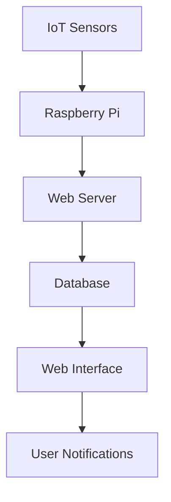

# IoT-Based Smart Mailbox System

[](LICENSE)
[](https://www.python.org/)
[](https://developer.mozilla.org/en-US/docs/Web/JavaScript)
[](https://www.php.net/)

## Overview
This project implements a smart mailbox system using IoT technology. It provides real-time monitoring of mail delivery status and notifications through a web interface.

### System Architecture


## Features
- Real-time mail detection
- Web-based monitoring interface
- Mobile notifications
- Mail delivery status tracking
- User authentication system
- Historical data analysis
- Multi-user support

## Project Structure
```
IoTBasedSmartMailboxSystem/
├── Python/              # IoT control scripts
│   ├── main.py         # Main control logic
│   └── sensors/        # Sensor interface
├── WEB/                # Web interface
│   ├── index.html      # Main interface
│   ├── api/            # API endpoints
│   └── assets/         # Static resources
├── Database/           # Database schemas
└── README.md          # This file
```

## Hardware Requirements
- Raspberry Pi 3 or higher
- IR sensors
- LED indicators
- Power supply
- Network connectivity

## Software Requirements
- Python 3.x
- PHP 7.x
- MySQL
- Apache/Nginx
- Modern web browser

## Installation

### Hardware Setup
1. Connect sensors to Raspberry Pi:
```bash
# GPIO pin configuration
SENSOR_PIN = 17
LED_PIN = 18
```

2. Power up the system:
```bash
# Check sensor status
python3 Python/sensors/test_sensors.py
```

### Software Setup
1. Install dependencies:
```bash
# System packages
sudo apt-get update
sudo apt-get install apache2 php mysql-server python3

# Python packages
pip install -r requirements.txt
```

2. Configure web server:
```bash
# Copy web files
sudo cp -r WEB/* /var/www/html/
```

3. Set up database:
```bash
# Initialize database
mysql -u root -p < Database/init.sql
```

## Usage

### Starting the System
1. Power on Raspberry Pi
2. Start the main service:
```bash
python3 Python/main.py
```

3. Access web interface:
```
http://localhost/index.html
```

### Monitoring Mail
1. Log in to web interface
2. View real-time status
3. Check notifications
4. Review delivery history

## Implementation Details

### Sensor Integration
- IR sensor for mail detection
- LED status indicators
- Power management
- Error handling

### Web Interface
- Real-time updates
- User authentication
- Mobile responsiveness
- Data visualization

### Database Structure
- User accounts
- Delivery records
- System logs
- Configuration settings

## Security Features
- Secure authentication
- Data encryption
- Access control
- Audit logging

## Performance Optimization
- Efficient sensor polling
- Optimized database queries
- Caching mechanisms
- Resource management

## Testing
```bash
# Run sensor tests
python3 Python/sensors/test_sensors.py

# Run web interface tests
php WEB/tests/run_tests.php
```

## Contributing
1. Fork the repository
2. Create your feature branch (`git checkout -b feature/AmazingFeature`)
3. Commit your changes (`git commit -m 'Add some AmazingFeature'`)
4. Push to the branch (`git push origin feature/AmazingFeature`)
5. Open a Pull Request

## License
This project is proprietary and confidential.

## Author
Choi Hong Suk

## Acknowledgments
- Raspberry Pi Foundation
- IoT development community
- Open source contributors
